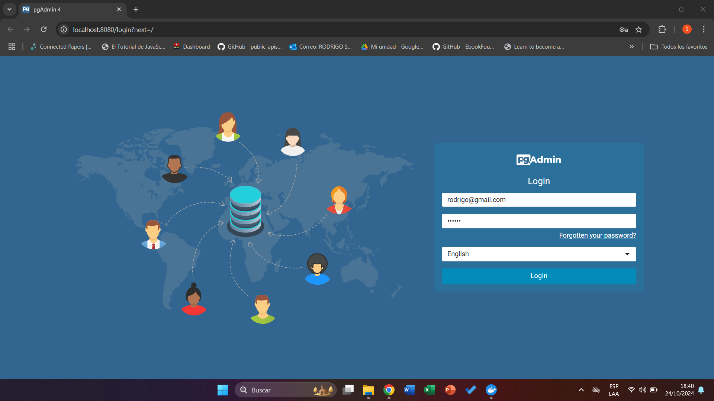
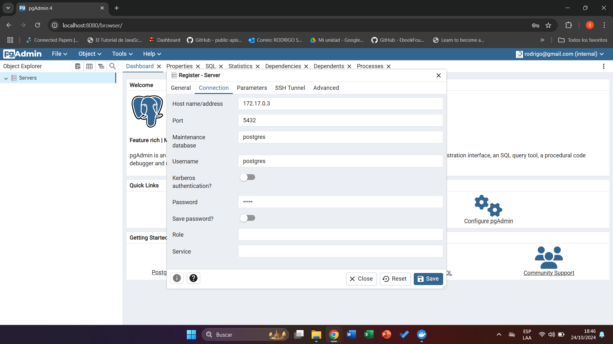
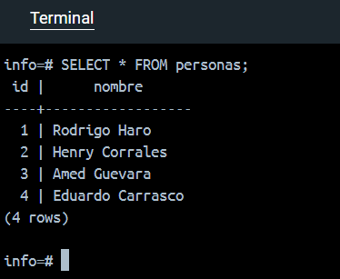

### Crear contenedor de Postgres sin que exponga los puertos. Usar la imagen: postgres:11.21-alpine3.17
```
docker run -d --name servidor_postgres -e POSTGRES_PASSWORD=12345 postgres:11.21-alpine3.17
```

### Crear un cliente de postgres. Usar la imagen: dpage/pgadmin4
```
docker run -d --name cliente_postgres -e PGADMIN_DEFAULT_EMAIL=rodrigo@gmail.com -e PGADMIN_DEFAULT_PASSWORD=qwerty -p 8080:80 dpage/pgadmin4
```

# COMPLETAR

La figura presenta el esquema creado en donde los puertos son:
- a: 8080
- b: 80
- c: 5432


## Desde el cliente
### Acceder desde el cliente al servidor postgres creado.



### Crear la base de datos info, y dentro de esa base la tabla personas, con id (serial) y nombre (varchar), agregar un par de registros en la tabla, obligatorio incluir su nombre.

```
CREATE TABLE personas (
    id SERIAL PRIMARY KEY,
    nombre VARCHAR(100) NOT NULL
);
INSERT INTO personas (nombre) VALUES ('Rodrigo Haro');
INSERT INTO personas (nombre) VALUES ('Henry Corrales');
INSERT INTO personas (nombre) VALUES ('Amed Guevara');
INSERT INTO personas (nombre) VALUES ('Eduardo Carrasco');
```

## Desde el servidor postgresl
### Acceder al servidor
```
docker exec -it servidor_postgres psql -U postgres
```
### Conectarse a la base de datos info
```
\c info
```
### Realizar un select *from personas


