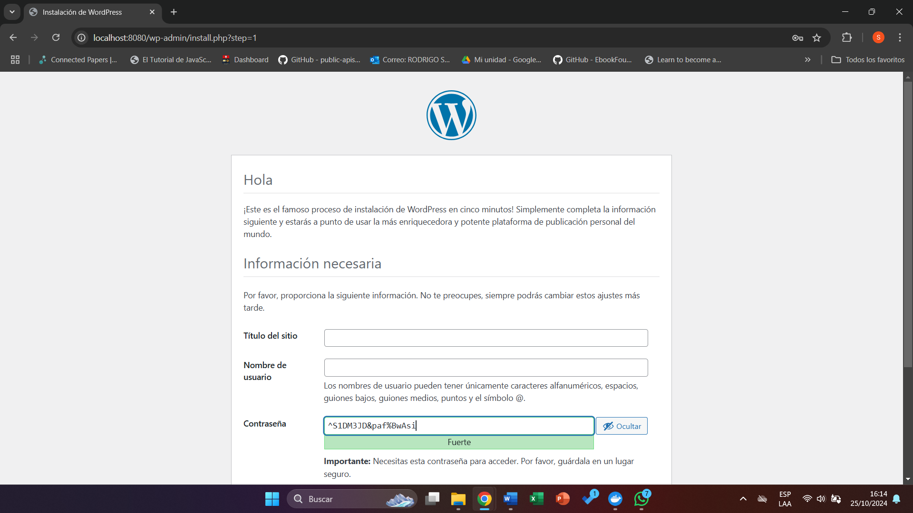
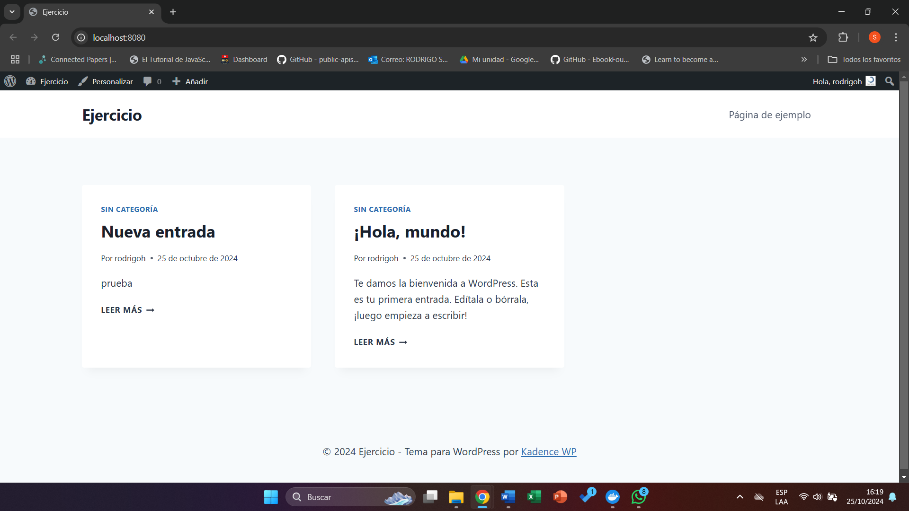

## Esquema para el ejercicio


### Crear la red
```
docker network create net-wp -d bridge
```

### Crear el contenedor mysql a partir de la imagen mysql:8, configurar las variables de entorno necesarias
```
---
MYSQL_ROOT_PASSWORD=qwerty
MYSQL_DATABASE=ejercicio
MYSQL_USER=rodrigoh
MYSQL_PASSWORD=12345
---
docker run -d --name mysql --env-file=variablesEntorno.txt --network net-wp mysql:8
```

### Crear el contenedor wordpress a partir de la imagen: wordpress, configurar las variables de entorno necesarias
```
---
WORDPRESS_DB_HOST=mysql:3306
WORDPRESS_DB_USER=rodrigoh
WORDPRESS_DB_PASSWORD=12345
WORDPRESS_DB_NAME=ejercicio
---
docker run -d --name wordpress --env-file=variablesWP.txt --network net-wp -p 8080:80 wordpress
```

De acuerdo con el trabajo realizado, en la el esquema de ejercicio el puerto a es 8080

Ingresar desde el navegador al wordpress y finalizar la configuración de instalación.


Desde el panel de admin: cambiar el tema y crear una nueva publicación.
Ingresar a: http://localhost:8080/ 
recordar que a es el puerto que usó para el mapeo con wordpress


### Eliminar el contenedor wordpress
```
docker rm -f wordpress
```

### Crear nuevamente el contenedor wordpress
Ingresar a: http://localhost:8080/ 
recordar que a es el puerto que usó para el mapeo con wordpress

### ¿Qué ha sucedido, qué puede observar?
Al intentar volver a acceder se visualiza una página en blanca, lo cual puede deberse a un problema de conexión entre Wordpress y la base de datos.


